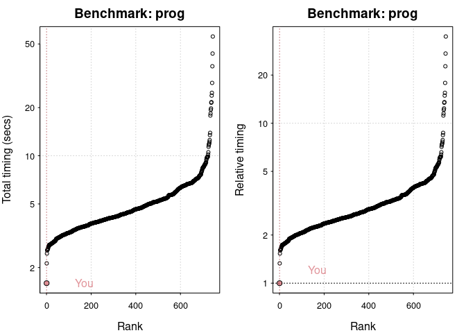
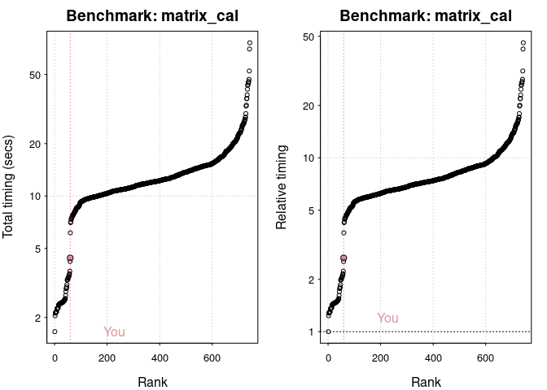
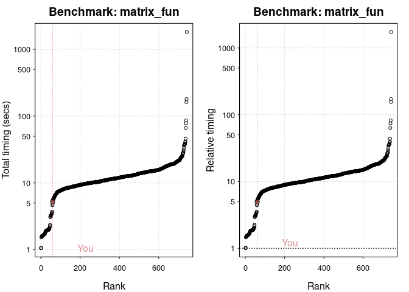
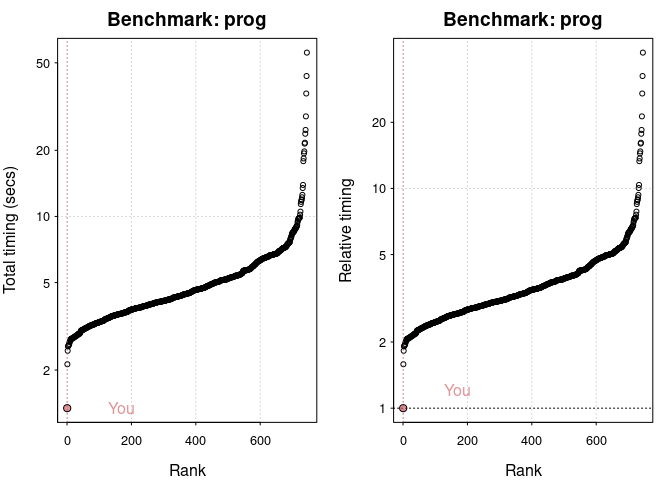
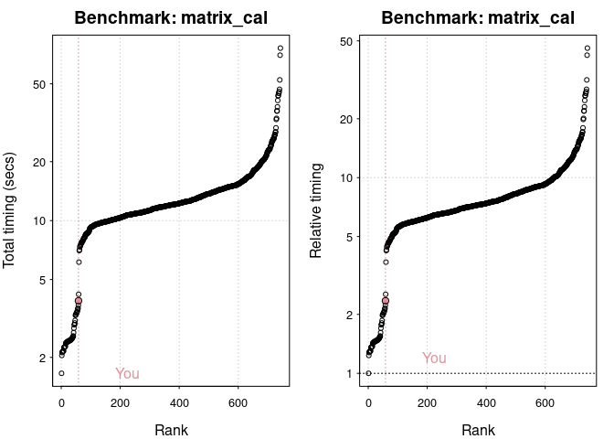
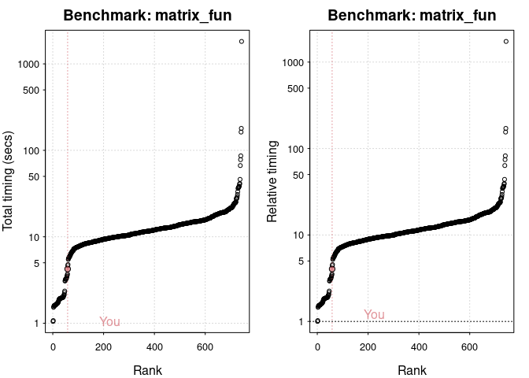

# Local benchmarking code


``` r
if (!requireNamespace("benchmarkme", quietly = TRUE)) {
  install.packages("benchmarkme")
}
library(benchmarkme)
```

# Poseidon 22

``` r
if (!file.exists("res-poseidon22.Rds")) {
  res = benchmark_std()
  saveRDS(res, "res-poseidon22.Rds")
}
```

``` r
res = readRDS("res-poseidon22.Rds")
sum(res$elapsed)
```

    [1] 33.657

``` r
plot(res)
```

    You are ranked 1 out of 749 machines.

    Press return to get next plot 

    You are ranked 60 out of 747 machines.



    Press return to get next plot 

    You are ranked 61 out of 747 machines.





# Workstation Pro

``` r
res = readRDS("res-wsp24.Rds")
names(res)
```

    [1] "user"       "system"     "elapsed"    "test"       "test_group"
    [6] "cores"     

``` r
sum(res$elapsed)
```

    [1] 28.42

``` r
plot(res)
```

    You are ranked 1 out of 749 machines.

    Press return to get next plot 

    You are ranked 59 out of 747 machines.



    Press return to get next plot 

    You are ranked 59 out of 747 machines.




