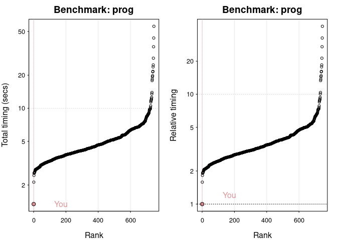
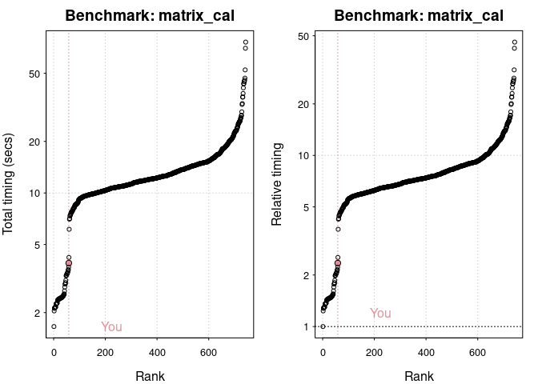
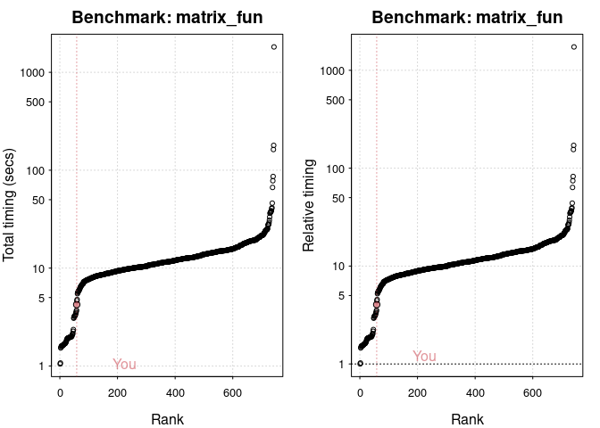

# Local benchmarking code


# Workstation Pro

``` r
list.files()
```

    [1] "LICENSE"          "README_files"     "README.md"        "README.qmd"      
    [5] "README.rmarkdown" "res-wsp24.Rds"   

``` r
library(benchmarkme)
res = readRDS("res-wsp24.Rds")
names(res)
```

    [1] "user"       "system"     "elapsed"    "test"       "test_group"
    [6] "cores"     

``` r
sum(res$elapsed)
```

    [1] 28.42

``` r
plot(res)
```

    You are ranked 1 out of 749 machines.

    Press return to get next plot 

    You are ranked 59 out of 747 machines.



    Press return to get next plot 

    You are ranked 59 out of 747 machines.




